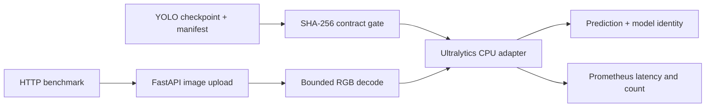

# #7 vision-serving-fastapi

**Measured baseline:** `45.553 req/s` with p95 `28.662 ms` across `20` successful HTTP requests at concurrency `1` on CPU.

**Proves:** a FastAPI service loads and verifies a real YOLO26n checkpoint produced by `yolo-training-pipeline`, decodes PNG input, executes Ultralytics inference, exposes Prometheus metrics, and reports reproducible HTTP throughput.

## Evidence

| Measure | Result |
|---|---:|
| Throughput | `45.553 req/s` |
| HTTP p95 latency | `28.662 ms` |
| Requests / errors | `20 / 0` |
| Warmup / concurrency | `3 / 1` |
| Checkpoint | `5,333,317 bytes` |
| Checkpoint SHA-256 | `41598b005401...` |

The checkpoint was trained from architecture-only initialization on the deterministic synthetic detection fixture in repository #1. Its held-out mAP50-95 is `0.002420`; this service proves artifact-to-HTTP delivery, not real-domain detection quality.

## Run

Build and run the benchmark:

```bash
docker build -t vision-serving-fastapi .
docker run --rm --network none vision-serving-fastapi benchmark --num-requests 20 --concurrency 1 --warmup-requests 3 --output /tmp/benchmark.json
```

Start the API:

```bash
docker run --rm -p 8000:8000 vision-serving-fastapi
```

Endpoints:

| Method | Path | Contract |
|---|---|---|
| `GET` | `/health` | readiness and loaded checkpoint identity |
| `POST` | `/predict` | PNG/JPEG upload to real YOLO inference |
| `GET` | `/metrics` | Prometheus text exposition format |

## Architecture



This is a modular monolith because one independently deployable process owns artifact loading, HTTP transport, telemetry, and load measurement. Tests inject the model boundary; production loads only the provenance-checked bundle. No database, broker, cloud service, or cache is justified by this workload.

## Reproducibility

- Runtime: Python `3.12.13`, Ultralytics `8.4.96`, CPU PyTorch `2.13.0`.
- Model bundle: `models/best.pt` plus `models/model-manifest.json`.
- Raw result: `benchmarks/results/benchmark.json`.
- Publication config: `benchmarks/config/vision-serving-v1.json`.
- Default benchmark needs no network, GPU, credential, or external service.

The code and combined Docker distribution use `AGPL-3.0-only` because the runtime imports Ultralytics. See [REFERENCES.md](REFERENCES.md).
