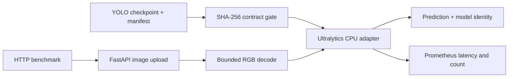

# Vision Model Serving with FastAPI: Verified YOLO Checkpoint behind an Instrumented API

**`39.200 req/s` with p95 `27.343 ms`** for real YOLO inference over HTTP on CPU (single client, 20 measured requests, zero errors). The service refuses to start unless the checkpoint matches its SHA-256 manifest.

[](https://github.com/Brilhante29/vision-serving-fastapi/actions/workflows/validate.yml)
[](LICENSE)


## Why this exists

Research code ends at `best.pt`. Production starts with harder questions: is this the checkpoint we evaluated, what happens with a malformed upload, how slow is it under load, and how would anyone know at 3 a.m.? This service answers them for the checkpoint produced by [yolo-training-pipeline](https://github.com/Brilhante29/yolo-training-pipeline):

- the model bundle is loaded only if its SHA-256 matches the training manifest, and `/health` reports which checkpoint is live;
- uploads are decoded with explicit bounds before inference;
- Prometheus counters and latency histograms are exposed at `/metrics`;
- a built-in load generator measures the same HTTP path that clients use.

## Results

| Measure | Result |
|---|---:|
| Throughput | `39.200 req/s` |
| HTTP p95 latency | `27.343 ms` |
| Requests / errors | `20 / 0` |
| Warmup / concurrency | `3 / 1` |
| Checkpoint | `5,333,317 bytes` |
| Checkpoint SHA-256 | `41598b005401...` |

This is a single-client latency profile, not a capacity test. The checkpoint comes from a from-scratch smoke run (held-out mAP50-95 `0.002420`), so the service proves artifact-to-HTTP delivery, not detection quality.

## Quickstart

Run the benchmark:

```bash
docker build -t vision-serving-fastapi .
docker run --rm --network none vision-serving-fastapi benchmark --num-requests 20 --concurrency 1 --warmup-requests 3 --output /tmp/benchmark.json
```

Start the API:

```bash
docker run --rm -p 8000:8000 vision-serving-fastapi
curl -s localhost:8000/health
curl -s -F "file=@image.png" localhost:8000/predict
```

| Method | Path | Contract |
|---|---|---|
| `GET` | `/health` | Readiness and loaded checkpoint identity |
| `POST` | `/predict` | PNG/JPEG upload to real YOLO inference |
| `GET` | `/metrics` | Prometheus text exposition format |

## How it works


```mermaid
flowchart LR
  Bundle["YOLO checkpoint + manifest"] --> Verify["SHA-256 contract gate"]
  Verify --> Adapter["Ultralytics CPU adapter"]
  Upload["FastAPI image upload"] --> Decode["Bounded RGB decode"]
  Decode --> Adapter
  Adapter --> Response["Prediction + model identity"]
  Adapter --> Metrics["Prometheus latency and count"]
  Load["HTTP benchmark"] --> Upload
```

| Module | Responsibility |
|---|---|
| `model.py` | Bundle verification and the Ultralytics inference adapter |
| `app.py` | FastAPI routes, upload decoding, Prometheus instrumentation |
| `benchmark.py` | HTTP load generation and percentile evidence |
| `domain.py`, `cli.py` | Value objects and the `serve` / `benchmark` commands |

## Design decisions

| Decision | Why | Rejected |
|---|---|---|
| Modular monolith | One deployable process owns loading, transport, telemetry, and measurement | Splitting model server and API before load requires it |
| Integrity gate at startup | A wrong checkpoint should fail fast, not serve silently | Trusting whatever file is mounted |
| Injected model boundary in tests | API behavior is tested without loading PyTorch | Mocking Ultralytics internals |
| No database, broker, or cache | Nothing in the workload needs them | Infrastructure for its own sake |

## Limitations

- Concurrency 1 and 20 requests: tail latency under contention is not characterized.
- CPU only; no batching, ONNX export, or GPU path yet.
- No authentication or rate limiting on the API; put it behind a gateway such as [api-gateway-lite](https://github.com/Brilhante29/api-gateway-lite).

## Reproducibility

- Runtime: Python `3.12.13`, Ultralytics `8.4.96`, CPU PyTorch `2.13.0`.
- Model bundle: `models/best.pt` plus `models/model-manifest.json`.
- Raw result: [`benchmarks/results/benchmark.json`](benchmarks/results/benchmark.json); publication config: [`benchmarks/config/vision-serving-v1.json`](benchmarks/config/vision-serving-v1.json).
- The default benchmark needs no network, GPU, credential, or external service.

## Project structure

```text
src/vision_serving/   model adapter, FastAPI app, benchmark, domain, CLI
tests/                API, model boundary, benchmark, and domain tests
models/               checkpoint bundle and manifest from the training pipeline
benchmarks/           config, raw results, V2 publication evidence
tools/                benchmark and publication validators
sdd/  openspec/       specification, architecture and technical decisions
```

## How this repository is built

The project follows the spec-driven workflow of [portfolio-reuse-kit](https://github.com/Brilhante29/portfolio-reuse-kit). Requirements and decisions live in [`sdd/`](sdd) and [`openspec/`](openspec), and [`project.yaml`](project.yaml) records the architecture, stack, and rejected alternatives. Development is AI-assisted and human-governed: [`AGENTS.md`](AGENTS.md) and [`CLAUDE.md`](CLAUDE.md) hold the coding-agent instructions, while tests, validators, and CI decide what gets published.

## Related work

- [yolo-training-pipeline](https://github.com/Brilhante29/yolo-training-pipeline): produces and versions the checkpoint served here.
- [mlops-end2end](https://github.com/Brilhante29/mlops-end2end): registry-governed promotion for a tabular model.
- [observability-stack](https://github.com/Brilhante29/observability-stack): correlating metrics, traces, and logs for one incident.

See [`REFERENCES.md`](REFERENCES.md) for framework and license references.

## Author

**Guilherme Brilhante**, software engineer working on scalable backends and production AI.
[LinkedIn](https://www.linkedin.com/in/guilhermefreirebrilhanteseveriano/) · [GitHub](https://github.com/Brilhante29) · [Publications](https://dblp.org/pid/353/6812.html)

## License

[AGPL-3.0-only](LICENSE), because the runtime imports Ultralytics.
